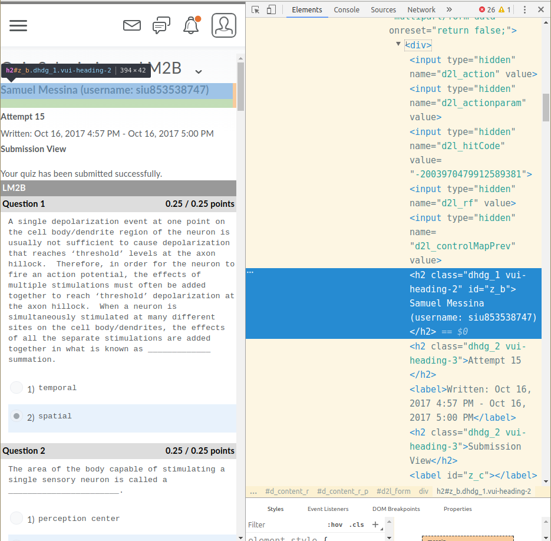
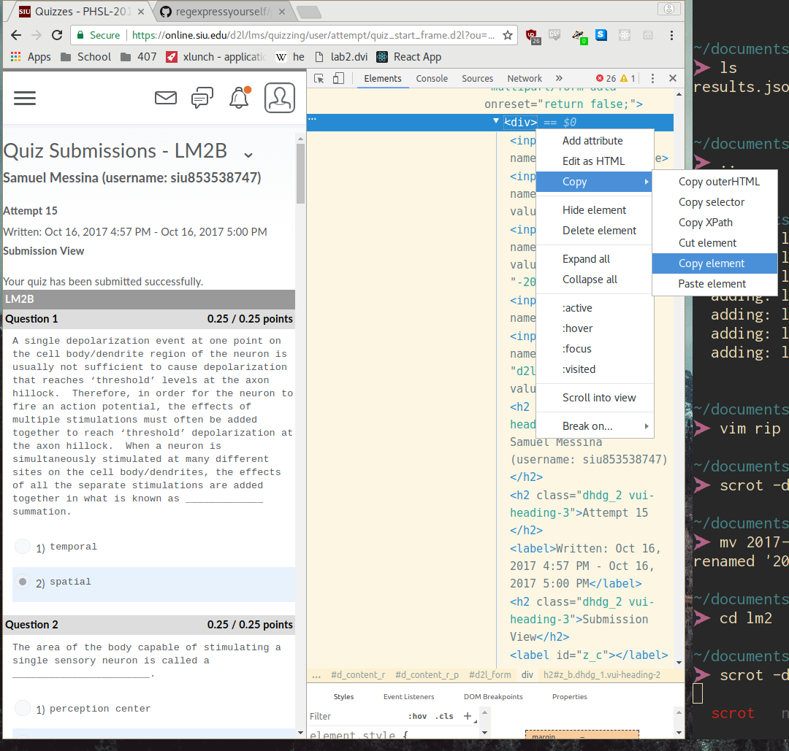

# Rip Quiz Data from PHSL practice quizzes

## Getting up and running
1. install Python 3
2. pip install all dependencies:
```
pip install json
pip install pyperclip
pip install time
pip install codecs
```
3. Run the ripper: `python3 ripper.py`

## Using the ripper
1. Start a quiz, keeping the python window running the ripper open.

2. Copy part of a question (try to avoid non-alphanumeric characters, as parsing from HTML -> string -> JSON can get wonky sometimes)

3. If the question is in results.json, it will be displayed.

  - if there is a correct answer logged, the correct answer will be shown
  - if there is no correct answer logged, all incorrect attempts will be shown

## Updating results.json

1. After finishing and submitting the quiz, right click on your name at the top and click "Inspect Element" (shown below)



2. Right click and copy the plain div above it, which acts as the parent to the h2 element we clicked (shown below)



3. Paste the copied HTML into "tests.html"

4. Re-reun the ripper.py file, and the new data will be added to results.json

5. (optional) you are welcome to delete the contents of tests.html after running ripper.py, all data will have been stored in results.json

## Additional Notes

There is also a "searcher".js" file. This is an attempt at being able to utilize js in the console to perform the heavy lifting, but is not a complete idea. I may look into using the console more after exam 2.

